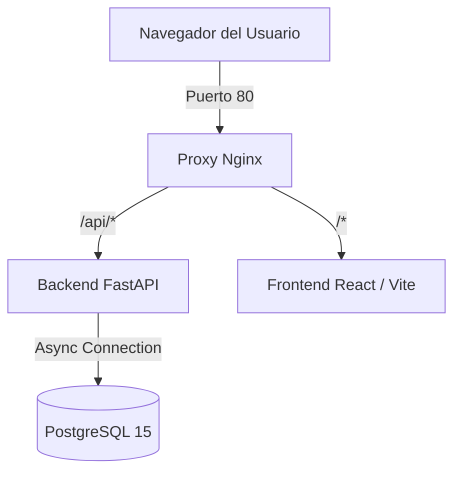
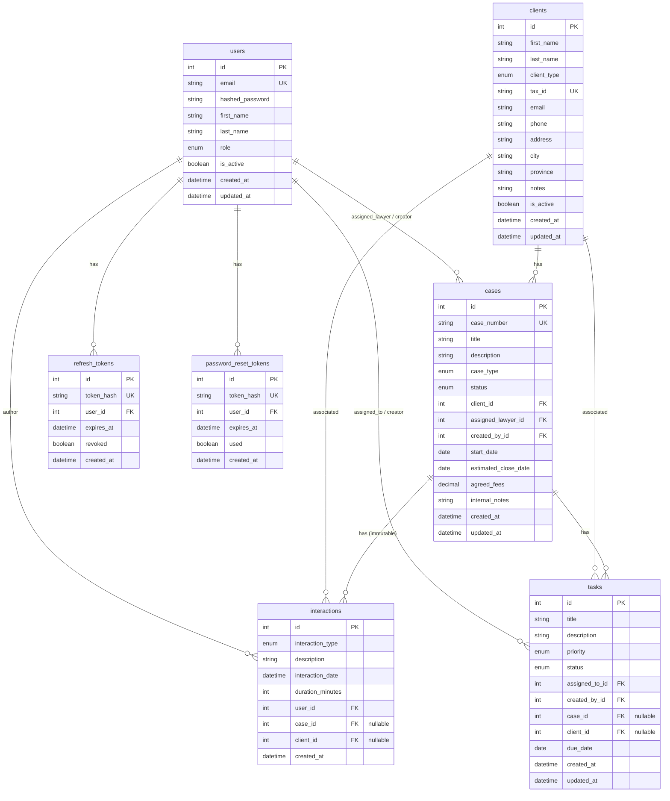

# 📋 Estado y Bitácora del Proyecto — CRM Lex Studio

Este documento sirve como el estado de situación y log histórico del proyecto **CRM Lex Studio**. Debe ser actualizado por el desarrollador o agente al finalizar cada sesión de trabajo para mantener la trazabilidad de los cambios, tareas pendientes y decisiones de diseño.

---

## 📅 Información de Control

*   **Última Actualización:** 2026-06-23
*   **Rama Git Activa:** `main`
*   **Estado del Repositorio:** Cambios en preparación para commit (remoción de `.env`, `.venv` y `.pyc` + agregado de `.gitignore`).
*   **Despliegue Local:** Docker Compose (PostgreSQL, FastAPI, React/Vite, Nginx)

---

## 🏗️ Arquitectura y Stack Tecnológico

La plataforma está estructurada como una aplicación web Full-Stack dockerizada con aislamiento estricto y proxy inverso:



### Tecnologías Utilizadas

| Capa | Componente | Descripción |
| :--- | :--- | :--- |
| **Backend** | Python 3.11 + FastAPI | REST API asíncrona robusta y validada con Pydantic v2. |
| **Base de Datos** | PostgreSQL 15 | Almacenamiento relacional administrado de forma asíncrona (`asyncpg`). |
| **Migraciones** | Alembic | Versionado y control de esquemas de tablas SQL. |
| **Frontend** | React 18 (Vite) | Single Page Application (SPA) modular e interactiva. |
| **Estilos** | Tailwind CSS 3 | Diseño premium con paleta legal `navy` (azul marino) y `gold` (oro). |
| **Estado Remoto** | TanStack React Query v5 | Sincronización y caché de datos del backend. |
| **Ruteo Frontend** | React Router DOM v6 | Gestión de la navegación y protección de rutas. |
| **Proxy / Web** | Nginx | Proxy inverso que añade cabeceras HTTP de seguridad estrictas (`CSP`, `HSTS`, etc.). |
| **Contenedores** | Docker & Compose | Orquestación completa en entornos locales y de producción. |

---

## 🗄️ Modelo de Datos y Relaciones

El backend utiliza SQLAlchemy 2.0 (estilo asíncrono moderno con `Mapped` y `mapped_column`). Las entidades y sus relaciones se estructuran del siguiente modo:



---

## 🔒 Mecanismos de Seguridad Clave

1.  **Aislamiento de Datos por Rol:**
    *   `Admin`: Acceso completo a todas las secciones (administración de personal y configuraciones).
    *   `Lawyer` (Abogado): Solo puede visualizar y gestionar expedientes y tareas en las que esté asignado directamente.
    *   `Assistant` (Asistente): Acceso de lectura global (Dashboard consolidado de la oficina), pero bloqueado para operaciones de eliminación.
2.  **Inmutabilidad del Historial (Interacciones):** No existen rutas o endpoints para editar o eliminar gestiones/interacciones una vez registradas.
3.  **Seguridad JWT y Rotación de Tokens:** Tokens de acceso efímeros (60 minutos) con cookies/tokens de refresco encriptados en base de datos bajo algoritmo SHA-256 con rotación automática (Token Rotation).
4.  **Rate Limiting & Lockout:** Límite estricto de intentos de inicio de sesión (máximo 5 por IP cada 15 min; bloqueo de cuenta de correo después de 10 fallos consecutivos).

---

## ⚙️ Configuración del Entorno y Comandos Útiles

El archivo `.env` controla el comportamiento de la aplicación.
*   **Rate Limiting en desarrollo:** Se puede desactivar temporalmente con `ENABLE_RATE_LIMITER=False`.
*   **Recuperación de contraseña local:** Si `SMTP_HOST` está vacío, el enlace y token de recuperación se imprimen directamente en la consola del backend (`docker compose logs -f backend`).

### Comandos de Operación

*   **Levantar el entorno dockerizado:**
    ```bash
    docker compose up --build -d
    ```
*   **Aplicar migraciones de base de datos:**
    ```bash
    docker compose exec backend alembic upgrade head
    ```
*   **Crear el primer usuario administrador (seeding):**
    ```bash
    docker compose exec backend python seed_admin.py
    ```
*   **Correr suite de pruebas unitarias (Backend):**
    ```bash
    # En directorio backend/
    DATABASE_URL=sqlite+aiosqlite:///:memory: SECRET_KEY=testkey PYTHONPATH=. pytest
    ```

---

## 📝 Bitácora de Sesiones de Trabajo (Work Log)

| Fecha | Autor (Agente) | Objetivo Principal | Acciones Realizadas | Estado del Proyecto / Notas |
| :--- | :--- | :--- | :--- | :--- |
| **2026-06-23** | Antigravity | Análisis inicial del proyecto y generación del log de estado | - Inspección de la estructura de archivos en backend, frontend, nginx y docker.<br>- Comprobación del estado limpio de la rama `main` de Git.<br>- Análisis de modelos de base de datos (`Case`, `Client`, `Interaction`, `Task`, `User`, `Token`).<br>- Creación de este archivo de estado ([PROJECT_STATUS.md](file:///D:/Lab/crm-lawfirm/PROJECT_STATUS.md)). | **Limpio e Inactivo**.<br>Entorno dockerizable listo para desarrollo de features. |
| **2026-06-23 (Sec)** | Antigravity | Corrección de inconsistencias de Git y análisis de mejoras | - Creación de [.gitignore](file:///D:/Lab/crm-lawfirm/.gitignore) en la raíz.<br>- Remoción del índice de Git del archivo `.env` (credenciales locales), la carpeta `backend/.venv` (sobrecarga de 4000+ dependencias compiladas) y carpetas `__pycache__` usando `git rm --cached`.<br>- Agregado y preparación de los archivos nuevos en Git.<br>- Identificación de inconsistencias en base de código (consultas N+1, problemas de concurrencia y proxies de datos). | **Listo para Commit**.<br>Archivos innecesarios/secretos removidos de Git y guardados localmente. |

---

## 🎯 Backlog y Inconsistencias Detectadas (To-Do & Fixes)

### 🚨 Inconsistencias de Seguridad y Git (Resueltas)
*   [x] **Falta de `.gitignore` y Fuga de Secretos:** El archivo `.env` con credenciales de desarrollo y la base de datos estaba siendo subido a Git.
*   [x] **Sobrecarga de Repositorio:** El entorno virtual de Python (`backend/.venv`) y los archivos compilados (`__pycache__`) estaban comprometidos en Git.
    *   *Resolución:* Se creó [.gitignore](file:///D:/Lab/crm-lawfirm/.gitignore), se corrió `git rm --cached` y se prepararon los archivos para el commit.

### 🔍 Inconsistencias y Mejoras de Código Detectadas
*   [ ] **Problema de Consulta N+1 en Dashboard:**
    *   *Ubicación:* [/api/dashboard/stats](file:///D:/Lab/crm-lawfirm/backend/app/main.py#L70) en `backend/app/main.py`.
    *   *Detalle:* Itera sobre las 10 actividades recientes y ejecuta una consulta SQL individual para obtener los nombres de usuario del autor de cada una.
    *   *Solución:* Utilizar un join SQL o `joinedload(Interaction.user)` en la consulta original.
*   [ ] **Falta de Fecha de Cierre Real en Expedientes:**
    *   *Ubicación:* [/api/dashboard/stats](file:///D:/Lab/crm-lawfirm/backend/app/main.py#L99) y [Case](file:///D:/Lab/crm-lawfirm/backend/app/models/case.py).
    *   *Detalle:* El conteo de expedientes cerrados en el mes usa `Case.start_date` como proxy, lo cual es incorrecto para casos abiertos en meses anteriores y cerrados este mes.
    *   *Solución:* Agregar un campo `closed_at` al modelo `Case` que se actualice al pasar a estado `CERRADO`.
*   [ ] **Condición de Carrera en Generación de Código de Expediente:**
    *   *Ubicación:* [/api/cases POST](file:///D:/Lab/crm-lawfirm/backend/app/routers/cases.py#L88) en `backend/app/routers/cases.py`.
    *   *Detalle:* Se genera un correlativo `EXP-YYYY-NNNN` contando los expedientes existentes. Si dos peticiones ocurren concurrentemente, generarán el mismo número y una fallará por violación de unicidad.
    *   *Solución:* Implementar secuencias a nivel base de datos o un bucle de reintento transaccional.
*   [ ] **Integración de Inteligencia Artificial (Gemini):**
    *   *Ubicación:* [config.py](file:///D:/Lab/crm-lawfirm/backend/app/config.py) y [.env.example](file:///D:/Lab/crm-lawfirm/.env.example).
    *   *Detalle:* Hay un placeholder para `GEMINI_API_KEY` pero ninguna funcionalidad del backend la utiliza.
    *   *Solución:* Diseñar módulos de IA para analizar expedientes judiciales.
