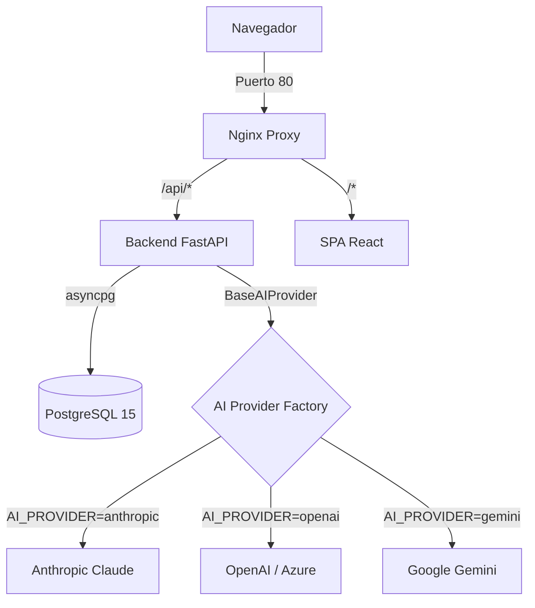

# 📋 Estado y Bitácora del Proyecto — CRM Lex Studio

Bitácora viva del proyecto. Debe actualizarse al final de cada sesión de trabajo significativa.

---

## 📅 Información de control

- **Última actualización:** 2026-06-24
- **Rama Git activa:** `main`
- **Versión funcional:** v0.3 (Fase 3 completa — redacción asistida + export + templates dinámicos)
- **Tests:** 31/31 ✅ (sqlite-in-memory para unit; Postgres real en CI)
- **Build frontend:** ~393 KB / 112 KB gzip
- **Despliegue local:** Docker Compose (Postgres, FastAPI, React/Vite, Nginx) — dev y prod separados

---

## 🏗️ Arquitectura actual

### Decisión arquitectónica clave: capa de IA universal

Toda la app consume una interfaz abstracta `BaseAIProvider`. El switch entre proveedores es una variable de entorno — no hay código atado a Anthropic, OpenAI o Gemini en ningún lado fuera de `app/services/ai/<provider>.py`. Esto deja al cliente final libre de:

- Usar su suscripción existente con cualquier proveedor
- Cambiar de proveedor sin tocar la app
- Negociar precio con quien quiera

---

## ✅ Fases completadas

### Fase 1 — Hardening (seguridad y operación)
- Refresh token en **cookie HttpOnly** con rotación (XSS-resistente)
- Single-flight refresh en el cliente (evita N llamadas paralelas a `/refresh`)
- `alembic.ini` sin credenciales hardcodeadas
- Build de producción multi-stage (SPA estática en image de Nginx)
- `docker-compose.prod.yml` separado (sin source volumes, sin Node container)
- Scripts `setup.sh` y `setup.ps1` (un comando: docker → migrar → seed)
- Suite de tests: auth + RBAC + inmutabilidad (verifica rutas de FastAPI, no solo runtime)

### Fase 2 — IA conversacional
- Capa abstracta `BaseAIProvider` + adaptadores Anthropic / OpenAI / Gemini
- Factory que lee `AI_PROVIDER` y cachea la instancia (`lru_cache`)
- `ai_service.py` arma dossiers del caso (metadata + 30 interacciones + tasks abiertas)
- 3 endpoints SSE:
  - `POST /api/ai/cases/{id}/summary` (sync, resumen de 8 viñetas)
  - `POST /api/ai/cases/{id}/chat` (chat con contexto del caso)
  - `POST /api/ai/assistant` (asistente flotante global, sin contexto)
- Hook `useAIStream` consume SSE con `fetch` + `ReadableStream` (no se puede usar EventSource por auth header)
- UI: `ChatPanel` reutilizable, `FloatingAssistant` global, `CaseAIPanel` en el detalle de caso

### Fase 3 — Redacción asistida, export y templates dinámicos
- Modelo `Document` (append-only, `is_archived` para soft delete) + migración
- 4 templates de sistema en código: `carta_documento`, `intimacion_cobro`, `escrito_presentacion`, `convenio_honorarios`
- Wizard de 3 pasos en UI: picker → variables → streaming preview → guardar
- Export **DOCX** (python-docx) y **PDF** (reportlab) — puro Python, sin LibreOffice/Cairo en el image
- Parser de Markdown propio para alimentar ambos renderers (headings, listas, **bold**, *italic*)
- Modelo `CustomTemplate` con variables como JSON; built-in tiene precedencia sobre custom en caso de colisión
- CRUD `/api/templates/` admin-only (`RoleChecker`) + catálogo lectura libre (`GET /api/templates/catalog` con flag `is_builtin`)
- Página admin `/templates` con cards built-in (badge "Sistema") vs custom (editables)
- Modal con form: clave, nombre, descripción, instrucción para el modelo, editor dinámico de variables

---

## 🧪 Cobertura de tests

| Archivo | Foco | Tests |
| :--- | :--- | :--- |
| `test_main.py` | Health check | 1 |
| `test_auth.py` | Login OK/KO, cookie HttpOnly, rotación de token, logout revoca, endpoint protegido sin token | 7 |
| `test_rbac.py` | Lawyer ve solo sus casos, no puede ver ajenos por ID, admin ve todos, assistant no borra | 5 |
| `test_immutability.py` | No existen rutas PUT/PATCH/DELETE en `/interactions` (verifica tabla de rutas + runtime) | 6 |
| `test_export.py` | Parser de markdown distingue bloques, DOCX produce ZIP válido, PDF produce magic bytes | 4 |
| `test_templates.py` | Admin CRUD, lawyer no puede crear, no se puede shadowizar built-in, duplicados rechazados, catalog list | 8 |
| **Total** | | **31** |

---

## 🔑 Decisiones de diseño que conviene recordar

1. **Documents append-only.** Cada `guardar` es una fila nueva — nunca se sobrescribe. Soft delete con `is_archived`, igual que interactions.
2. **Built-in templates inmutables.** Viven en código (`document_templates.py`) y siempre ganan sobre custom. El admin extiende, no shadowiza.
3. **Refresh token NUNCA en localStorage.** Cookie HttpOnly, `Path=/api/auth`, `SameSite=lax`. El cliente nunca tiene acceso JS al refresh.
4. **Auth = bearer en header + cookie en refresh.** El access token corto sí va en `Authorization`; el refresh en cookie. Mejor del XSS y mejor UX que doble cookie.
5. **SSE con `fetch`, no `EventSource`.** EventSource no permite Authorization header. Se parsea el stream a mano (~30 líneas en `useAIStream`).
6. **Multi-proveedor desde el día 1.** No hay `import anthropic` fuera de `anthropic_provider.py`. Aplicar el mismo patrón si se agrega Mistral/Cohere/Bedrock.
7. **Export sin deps de sistema.** Se descartó WeasyPrint (necesita Cairo/Pango); python-docx + reportlab son puro Python y mantienen el image chico.

---

## 🛣️ Próximos pasos sugeridos (no comprometidos)

| Idea | Costo aprox | Cuándo conviene |
| :--- | :--- | :--- |
| Audit log de quién leyó qué documento | medio | Cuando el cliente lo pida por compliance |
| Versión multi-tenant (mismo deploy, varios estudios) | alto | Solo si el negocio crece a SaaS |
| Plantillas DOCX cargadas por el usuario (no Markdown) | medio | Si se piden "membrete del estudio" en exports |
| Adapter Mistral / Bedrock | bajo | Cuando un cliente lo pida (~70 LOC + tests) |
| OAuth con Google Workspace | medio | Si el estudio ya usa Google |
| Búsqueda full-text en documentos generados | medio | Cuando el catálogo crezca a >100 docs/caso |

---

## ⚠️ Cosas que NO conviene tocar sin pensarlo dos veces

- Las rutas `/interactions` (la inmutabilidad es un requisito legal — los tests fallan si se agrega PUT/DELETE)
- El scope del cookie de refresh (`Path=/api/auth`) — moverlo a `/` rompe el modelo de seguridad
- Mover `document_templates.py` a DB sin mantener la precedencia built-in > custom — admins podrían bloquear features de sistema
- `BaseAIProvider.complete()` y `.stream()` — son la frontera con cada SDK; cambios de firma rompen los 3 adapters
